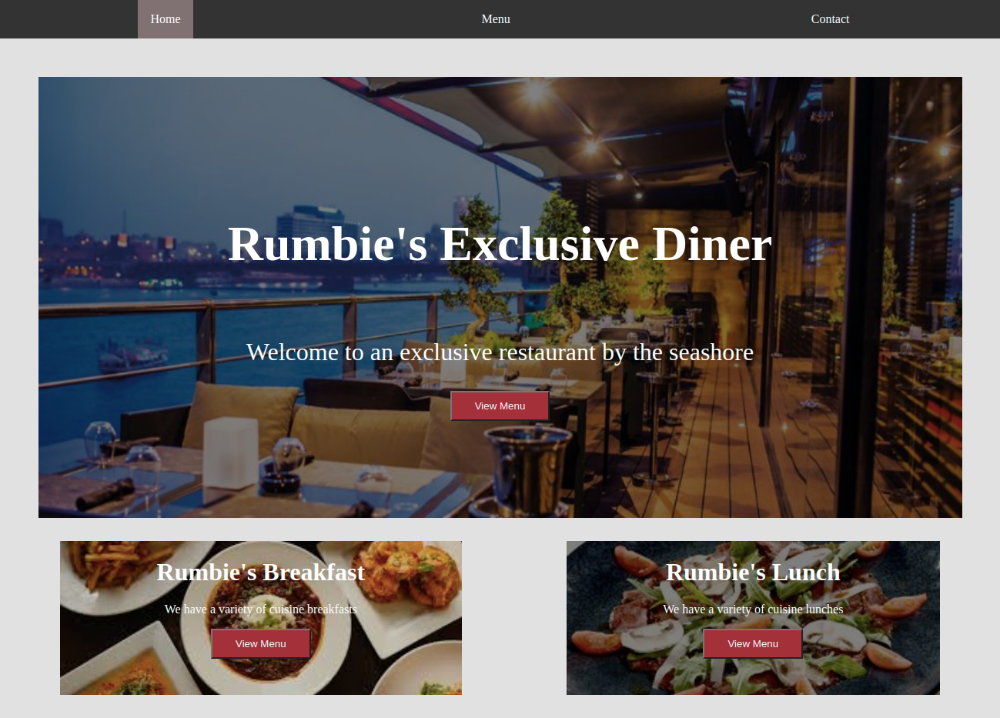

# Restaurant-Page

[Live Demo](https://rawcdn.githack.com/Rumbie-Mudzie7/Restaurant-page/614082065e8c9485307b72af2400fd897e0908aa/dist/index.html)

The Restaurant-page project demonstrates the Author's understanding of JavaScript fundamentals, that include Modules, ES6 concepts and DOM Manipulation, among others, by implementing the following requirements of the project:

1. Initializing the project with npm and setting up webpack.

2. Creating a src and dist directory with the following contents:
    - an index.js file in src.
    - an index.html file in dist. 

3. Using the DOM Manipulation to manipulate HTML elements in JavaScript.

4. Setting up the restaurant site to use tabbed browsing to access the Contact and Menu pages.

## Built With

- HTML5, JavaScript, ES6 and CSS3

## Getting Started

To get a local copy up and running follow these simple example steps.

### Prerequisites

- Code Editor of your choice
- Initialize npm by running `npm init` in your project terminal.
- Install and run webpack. For guideance on installing and running webpack, [ please visit](https://actualize.teachable.com/courses/347362/lectures/5396444)

### Setup

- To clone the repo to your local repository. Follow this steps
- <code> git clone https://github.com/Rumbie-Mudzie7/Restaurant-page.git</code>
- <code> cd restaurant-page</code>
- Open `src/index.js` in your preferred browser.

## Author

:bust_in_silhouette: **Rumbidzayi Mudziviri**
- Github: [@Rumbie-Mudzie7](https://github.com/Rumbie-Mudzie7)
- Twitter: [@RumbidzayiMudz3](https://twitter.com/RumbidzayiMudz3)
- Linkedin: [rumbidzayimudziviri](https://www.linkedin.com/in/rumbidzayi-mudziviri)
- rumbiemudzie@gmail.com

## :handshake: Contributing

There are two ways of contributing to this project:
1.  If you see something wrong or not working, please check [the issue tracker section](https://github.com/Rumbie-Mudzie7/Restaurant-page/issues), if that problem you met is not in already opened issues then open the issue by clicking on `new issue` button.
2.  If you have a solution to that, and you are willing to work on it, follow the below steps to contribute:
    1.  Fork this repository
    1.  Clone it on your local computer by running `git clone https://github.com/Rumbie-Mudzie7/Restaurant-page.git` __Replace *Rumbie-Mudzie7* with the username you use on github__
    1.  Open the cloned repository which appears as a folder on your local computer with your favorite code editor
    1.  Create a separate branch off the *master branch*,
    1.  Write your codes which fix the issue you found
    1.  Commit and push the branch you created
    1.  Raise a pull request, comparing your new created branch with our original master branch [here](https://github.com/Rumbie-Mudzie7/Restaurant-page)

## Show your support

Give a :star:️ if you like this project!

## Acknowledgments
[Webpack tutorial](https://actualize.teachable.com/courses/347362/lectures/5396444)
[Microverse](https://www.microverse.org)
[Odin Project](https://https://www.theodinproject.com/courses/javascript/lessons/restaurant-page)

## :memo: License

MIT
